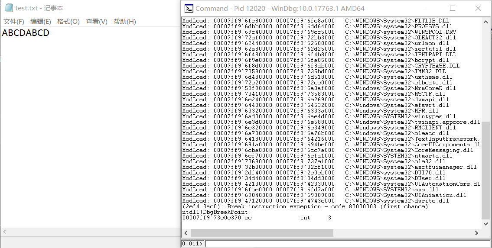
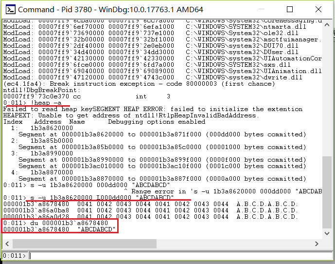
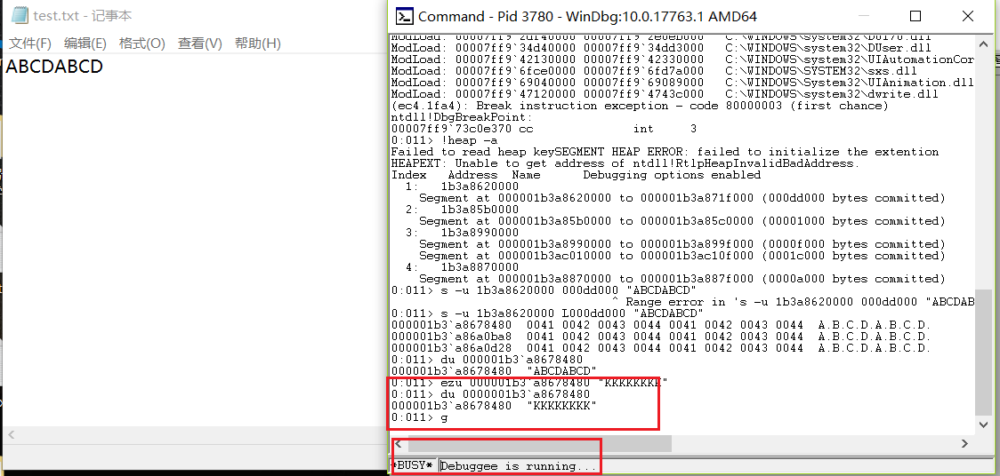
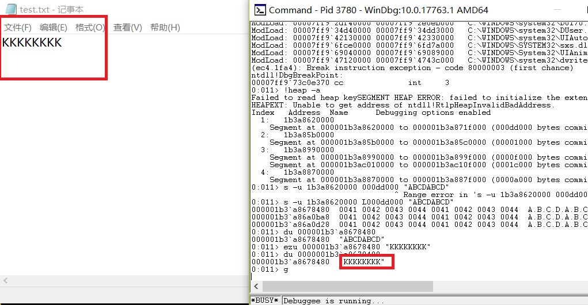

### 在notepad（32位64位均可）中，输入一段文字。然后使用调试器，在内存中修改这段文字。使得没有在界面操作notepad的修改文字的情况下。notepad中显示的文字变化。

提示:在调试器中定位控件缓存的内存地址，可以用搜索、逆向、消息截获分析、API截获分析等方法。

#### 实验工具

- windbg

#### 实验原理

- 找到存储字符串的内存地址，对里面对应的内容进行修改再执行
- 用户输入的数据，一般存储在堆中

#### 实验步骤

- 打开记事本，在其中输入内容

- 打开windbg,```File-->Attach to a Process-->By Executable```找到```notepad.exe```
  

- 查找输入数据所在的内存

  ```
  # 查看所有的堆信息
  !heap -a
  
  # 依次对每一个堆查找字符串
  #    堆起始位置   堆长度       查找内容
  s -u 1b3a8620000 L000dd000 "ABCDABCD"
  
  # 显示字符
  du 000001b3`a8678480
  
  ```
  

- 对上述得到的内存中的数据进行修改，并使程序继续执行

  ```
  # 修改字符串
  ezu 000001b3`a8678480 "KKKKKKKK"
  
  # 查看修改
  du 000001b3`a8678480
  
  # 继续运行程序
  g
  ```
  
  

#### 参考资料
- [JCKling](https://github.com/jckling/Day-Day-Up/tree/sf/%E8%BD%AF%E4%BB%B6%E4%B8%8E%E7%B3%BB%E7%BB%9F%E5%AE%89%E5%85%A8/3)
- [windbg修改notepad内容](https://blog.csdn.net/lixiangminghate/article/details/53086667)

