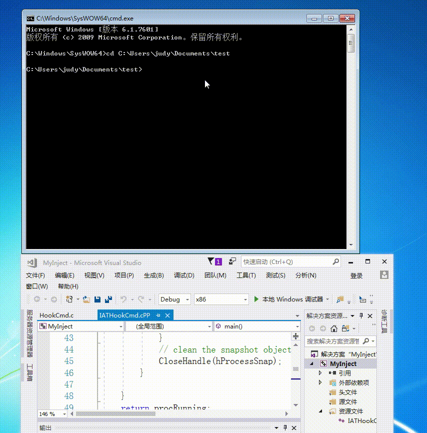

## 通过API hook的方法，使得cmd的dir命令看不到任意目录下的hack.exe 首先需要分析dir是通过什么API的调用来遍历目录的，然后hook相关函数。

### 实验环境
windows7
### 实验思路
- 查看```cmd.exe```导入表，结合msdn文档确定遍历文件目录调用的API(```FindFirstFileExW```,```FindNextFileW```)
- 沿用上一个实验的思路
    - 区别在于上一次实验是更改API参数，本次实验是更改调用API后的结果，所以本次实验会先调用API
    - 在```Fake_FindFirstFileExW```中，首先调用```FindFirstFileExW```函数，返回值为后续调用```FindNextFile```的搜索句柄，```lpFindFileData```参数中含有第一个文件/目录的信息。比较```lpFindFileData.cFileName```,若与需要隐藏的文件```hack.exe```相同，不进行返回，而是调用```FindNextFile```再返回，相当于跳过```hack.exe```的返回结果
    - ```Fake_FindNextFileW```与```Fake_FindFirstFileExW```思路相同
### 实验结果


### 参考资料
- [FindFirstFileExW](https://docs.microsoft.com/en-us/windows/desktop/api/fileapi/nf-fileapi-findfirstfileexw)
- [FindNextFileA](https://docs.microsoft.com/en-us/windows/desktop/api/fileapi/nf-fileapi-findnextfilea)
- [listing-the-files-in-a-directory](https://docs.microsoft.com/en-us/windows/desktop/FileIO/listing-the-files-in-a-directory)
