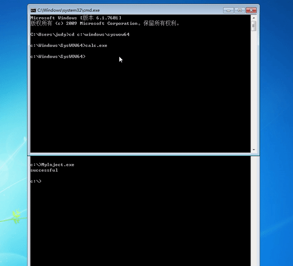
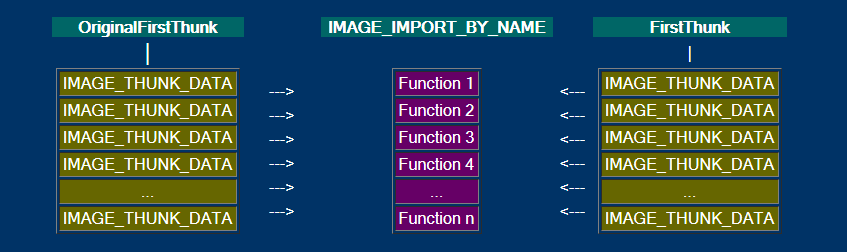
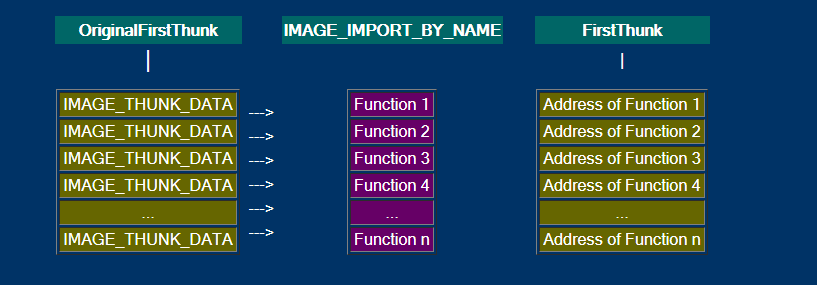
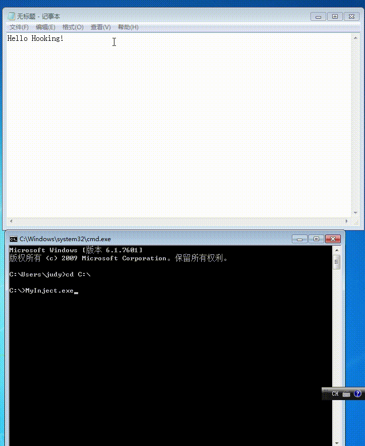

## 通过API hook的方法，在每次notepad保存txt文件时，就将文件内容修改为： “you have been hacked!”
API hook 的关键是编写一个假函数，用假函数的指针替换IAT中真函数的指针（当然这种方式只能对通过IAT调用的管用，但是够了。）在假函数调用真函数，修改真函数的参数和返回的数据，将修改后的数据返回给调用者。

### 实验环境

- windows7


### 实验过程
- DLL 远程注入
- 本地IATHOOK
- 远程注入IATHOOK

#### DLL 远程注入
##### 实验思路[过程]
- 注入过程
    - 枚举远程进程得到所需的进程ID
    - 根据进程ID获得进程句柄```[OpenProcess]```
    - 为远程进程远程分配空间
    - 将DLL路径写入分配的空间中
    - 获取```LoadLibraryA```函数地址，利用```LoadLibraryA```创建远程进程的线程
    - 等待远程线程执行完毕
##### 实验结果[以计算器为例，使计算器进程弹出消息框]


#### 本地IATHOOK
##### 实验思路
- 找到PE文件中导入表中需要hook的函数并进行替换
    - 验证是否为有效的PE文件
    - 从DOS头转到PE头
    - 获取```OptionalHeader```中数据目录地址
    - 转到数据目录的第二个成员，提取```VirtualAddress```的值
    - 使用```VirtualAddress```转到第一个```IMAGE_IMPORT_DESCRIPTOR```结构
    - 检查```OriginalFirstThunk```值，若它为0，改用```FirstThunk```的值
    - 对于数组中的每一个成员，使用```IMAGE_ORDINAL_FLAG```检查成员值，若成员最高位(MSB)为1，函数按照```ordinal ```导出，```IAMGE_ORDINAL_FLAG```中低位为```ordinal```，若MSB为0，按照函数名导出。
        - 一些函数导出只使用```ordinal```,不能通过函数名调用
    - 遍历数组成员，知道到达```null-terminated```
    - 跳到下一个```IMAGE_IMPORT_DESCRIPTOR```
    
    
#### 远程IATHOOK
##### 实验思路
将本地IATHook写出DLL进行远程注入
##### 实验结果

### 参考资料
- [pe-tut6](http://win32assembly.programminghorizon.com/pe-tut6.html)
- [Dynamic-Link Library Entry-Point Function](<https://docs.microsoft.com/en-us/windows/desktop/dlls/dynamic-link-library-entry-point-function>)
- [dll-injection-part2](<https://blog.adamfurmanek.pl/2016/04/02/dll-injection-part-2/>)
- [DLLMain](<https://docs.microsoft.com/en-us/windows/desktop/dlls/dllmain>)
- [dynamic-link-library-entry-point-function](<https://docs.microsoft.com/en-us/windows/desktop/dlls/dynamic-link-library-entry-point-function>)
- [CreateRemoteThread](<https://docs.microsoft.com/en-us/windows/desktop/api/processthreadsapi/nf-processthreadsapi-createremotethread>)
- [OpenProcess](<https://docs.microsoft.com/en-us/windows/desktop/api/processthreadsapi/nf-processthreadsapi-openprocess>)
- [iathook](https://github.com/luyj/iathook)
- [TheMasterOfMagic/SecurityOfSoftwareAndSystem](https://github.com/TheMasterOfMagic/SecurityOfSoftwareAndSystem)


