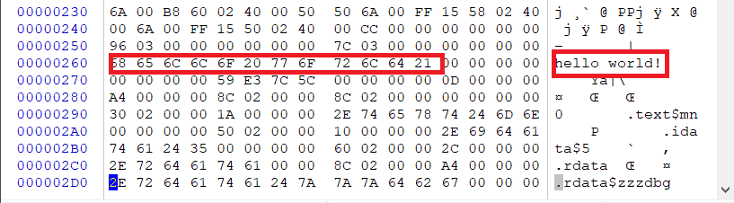
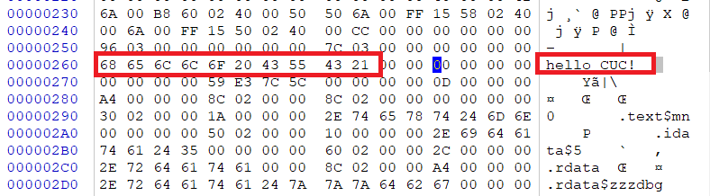
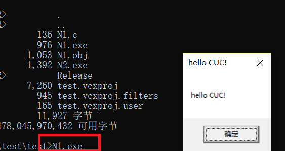
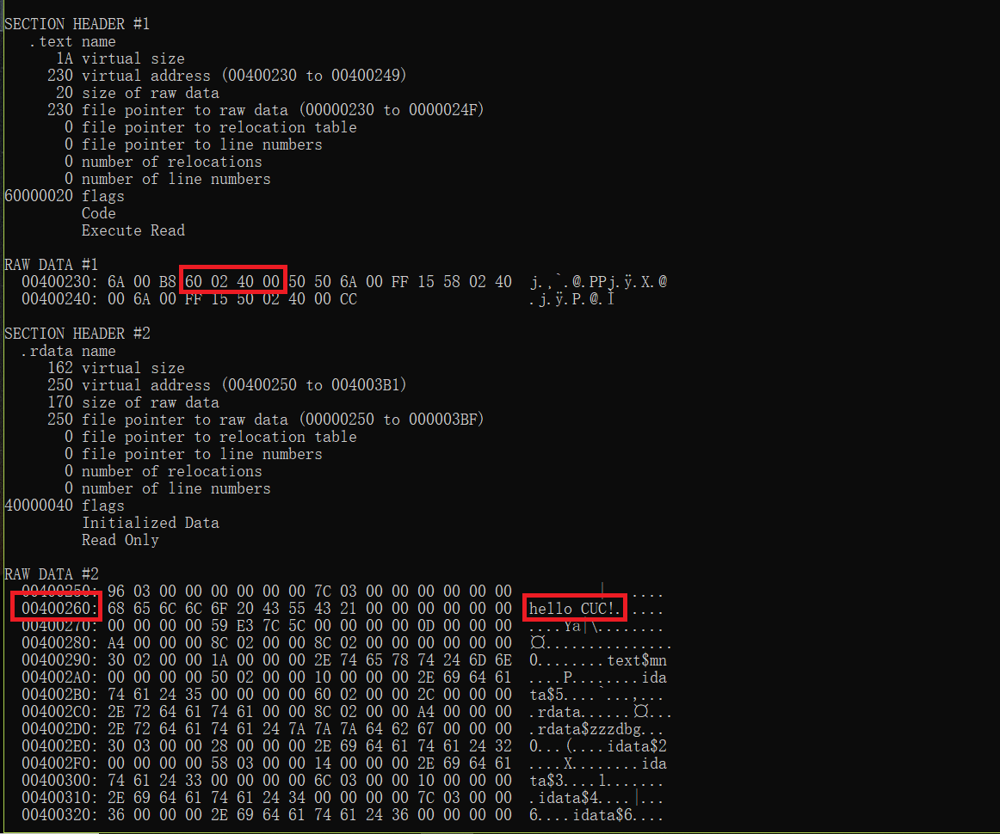
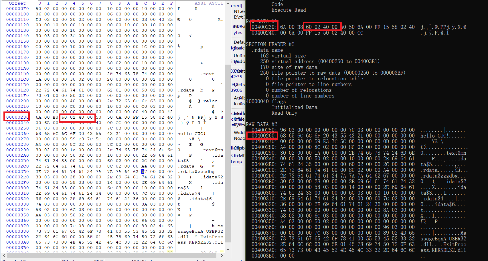
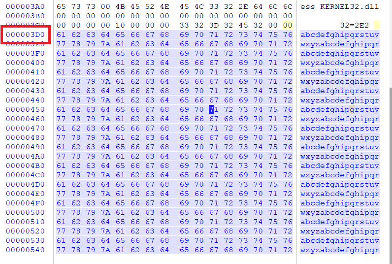
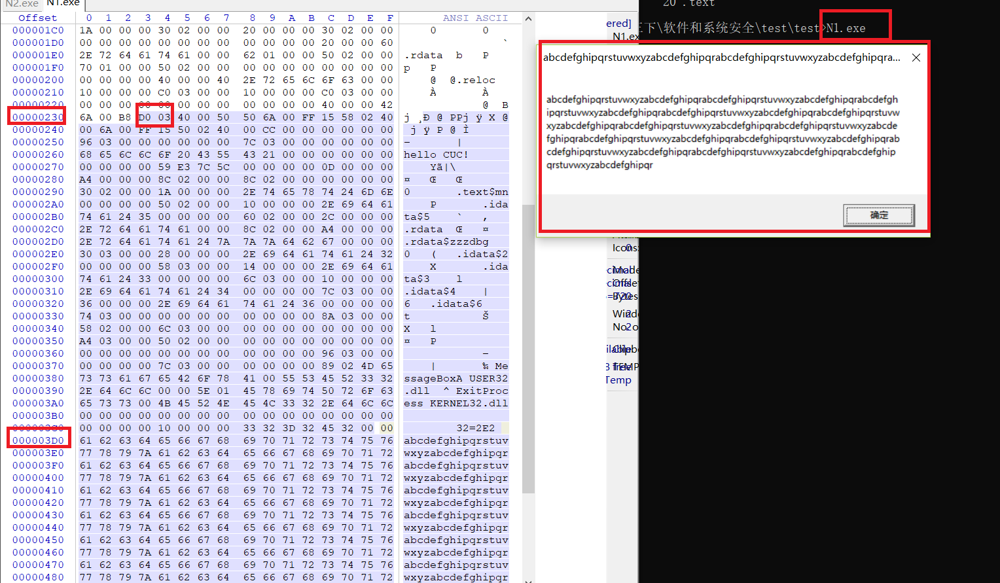

# 题1-2实验报告

程序源码

```c
#include <stdio.h>
#include <Windows.h>

int main()
{
	MessageBoxA(NULL,"hello world!","hello world!", MB_OK);
	ExitProcess(0);
}
```


### 1、编写一个release版本的 hello world 程序。通过修改程序可执行文件的方式（不是修改源代码），使得程序运行后显示的内容不为hello world，变成 hello cuc！

提示：一定要在编译选项中将调试信息相关的编译连接选项去掉，否则程序体积会比较大，而且存在很多“干扰”信息。

#### 实验步骤

- 减少生成的可执行文件的体积

  ```
  cl /c /O1 N1.c
  
  # 修改入口,只链接需要的库,减小文件对齐
  link /ENTRY:main /NODEFAULTLIB User32.lib kernel32.lib /ALIGN:16 N1.obj
  
  ```

​       

- 使用winhex修改字符串```hello world```为```hello cuc!```
  
  
- 结果
  

### 2、上一题的程序中，修改的显示内容变为一个很长的字符串（至少2kb长）。并且保证程序正常运行不崩溃。

提示，可执行文件中原有的空间有限，必须要新加入数据，加入数据后必须要修改.text字段中的指针。

- 使用```dumpbin /all N1.exe ```查看文件,找到函数参数填充地址的位置
  

- 在winhex中在文件的结尾添加字符串，并将原本函数参数填充的地址改为此字符串地址
  
  
  


