## Linux shellcode
在Linux环境中，让目标程序以不同于设计者预期的方式运行，操作方法之一是强制产生系统调用，通过系统调用，直接访问系统内核
##### Linux执行系统调用的方法
- linux下的每一个函数最终都通过系统功能调用sysenter(或int 0x80)实现，系统功能调用号用寄存器eax传递，其余参数用其它寄存器或堆栈传递
- C函数包装(libc)
- 使用汇编指令，将参数加载到寄存器，调用```int 0x80```软中断
#### shellcode小实验
##### Linux IA32系统调用
- exit.c
    ```c
    #include <stdio.h>
    #include <stdlib.h>
    void main()
    {
        exit(0x12);
    }
    ```
    ```bash
    #编译执行上述代码
    gcc -o exit exit.c
    ./exit
    echo $?
    ```
    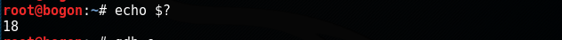
    - 跟踪调试```gdb e```
    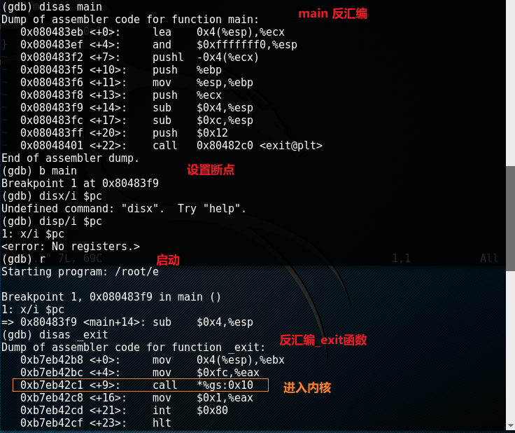
    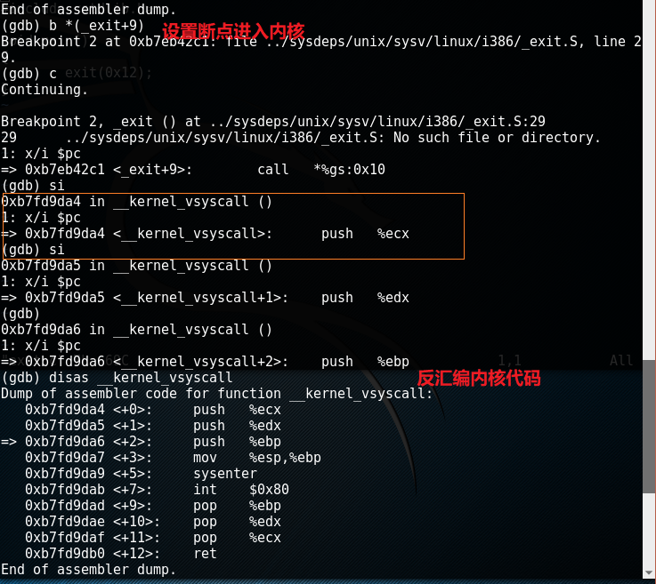
    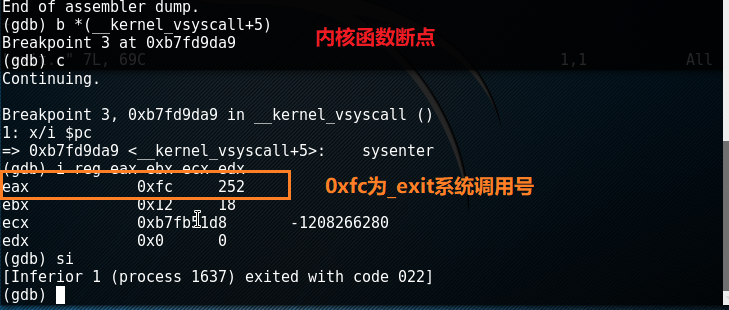
- shell.c
    ```c
    void main()
    {
        // 将_exit系统调用号保存在eax中，将参数存在ebx中，执行sysenter实现调用
        __asm__(
            "mov $0xfc,%eax;"
            "mov $0x12,%ebx;"
            "sysenter;"
        );
    }
    ```
    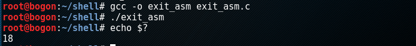
    ```c
    #include <stdio.h>
    void foo()
    {
        char *name[2];
        name[0]="/bin/sh";
        name[1]=NULL;
        execve(name[0],name,NULL);
    }
    int main(int argc,char*argv[])
    {
        foo();
        return 0;
    }
    ```
    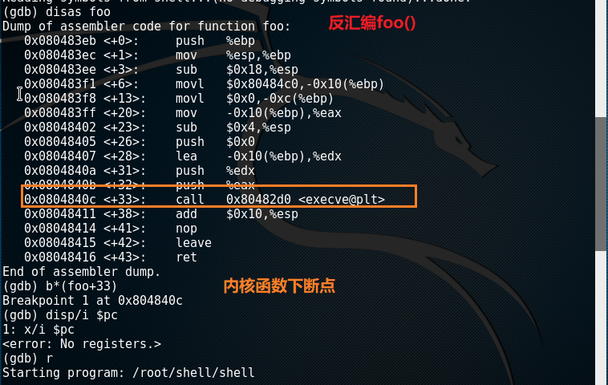
    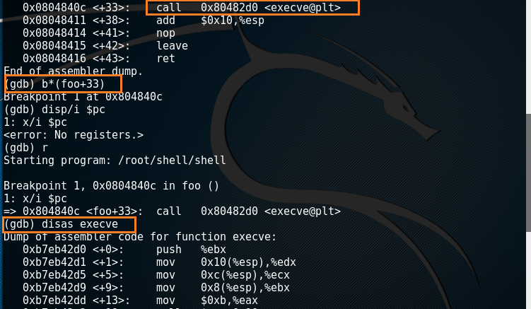
    
    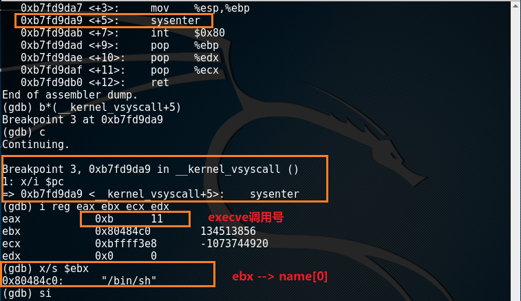
    使用shell.c对应的shell_asm.c编译出的二进制文件
    ```c
    void foo()
    {
        __asm__(
            "mov $0x0,%edx;"
            "push %edx;"
            "push $0x0068732f;"
            "push $0x6e69622f;"
            "mov %esp,%ebx;"
            "push %edx;"
            "push %ebx;"
            "mov %esp,%ecx;"
            "int $0x80;"
        );
    }
    ```
    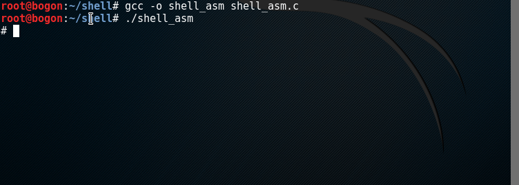


#### Bro-Unicorn shellcode代码检测
代码来源[BroIDS_Unicorn](https://github.com/Mipu94/BroIDS_Unicorn)
##### 实现原理
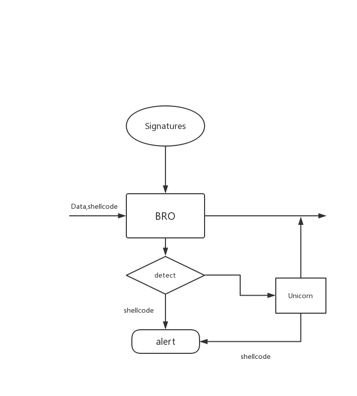
- Bro捕获数据，与已有的shellcode签名进行比较，初步判断是否有shellcode
- 若Bro无法判断，则将有效负载发送到Unicorn模拟执行检查是否产生系统调用

#### 实验复现
##### 环境搭建
```bash
sudo apt-get install cmake make gcc g++ flex bison libpcap-dev libssl-dev python-dev swig zlib1g-dev

# install bro
sudo apt-get install bro
sudo apt-get install bro-aux

# install broccoli-python
git clone --recursive https://github.com/zeek/broccoli-python.git
./configure
make
python setup.py install
```
##### 拓扑结构
- 客户端 ：
    ip: ```NatNetwork:10.0.2.8```
- 服务器端:
    ip:```NatNetwork:10.0.2.15```
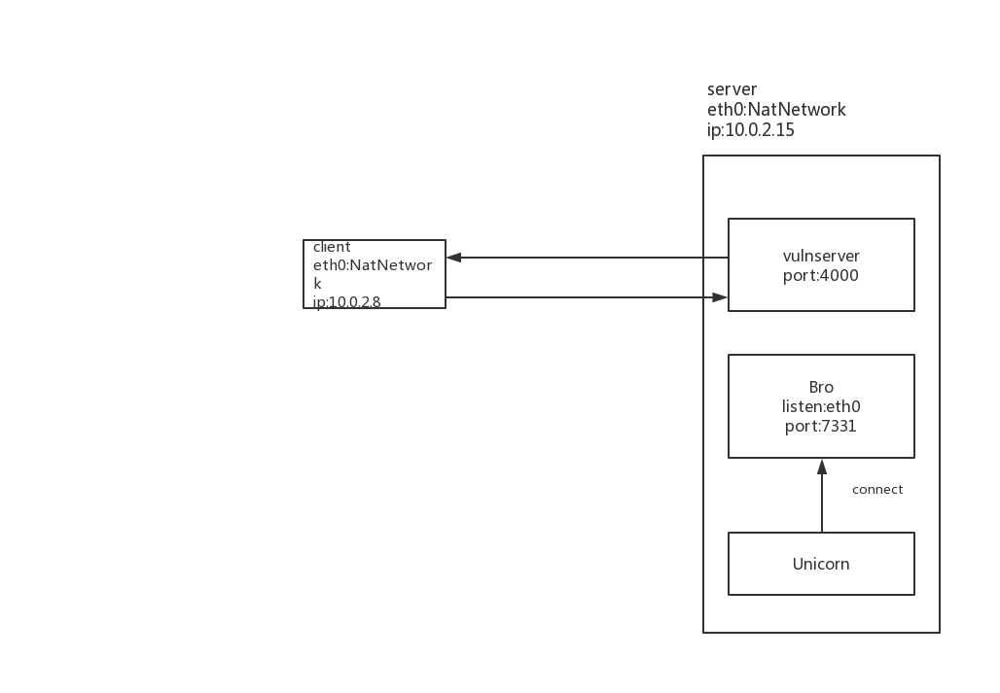

##### 实验结果
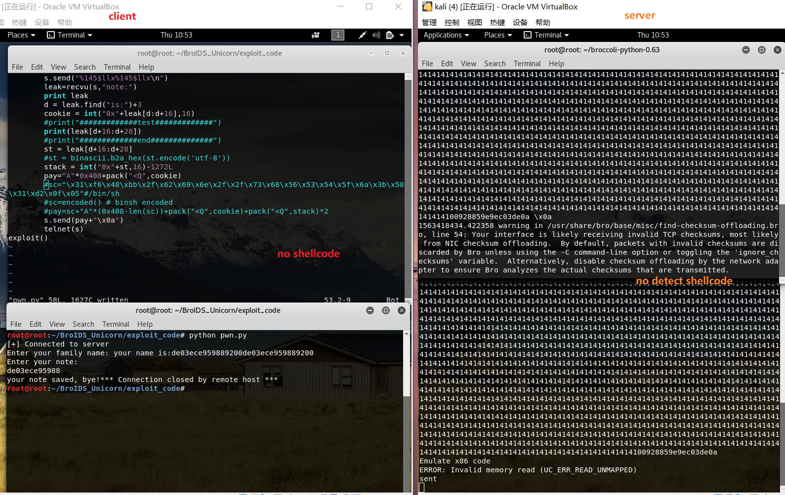
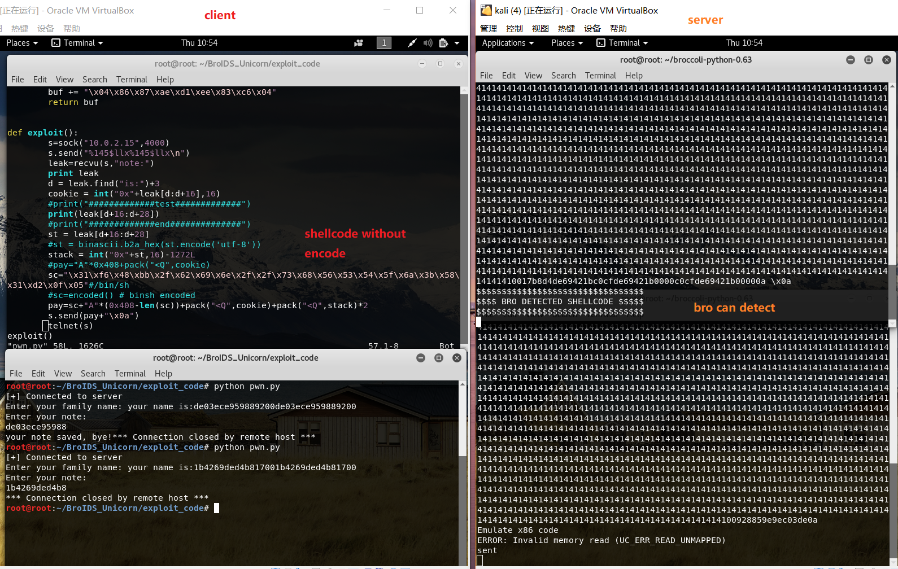
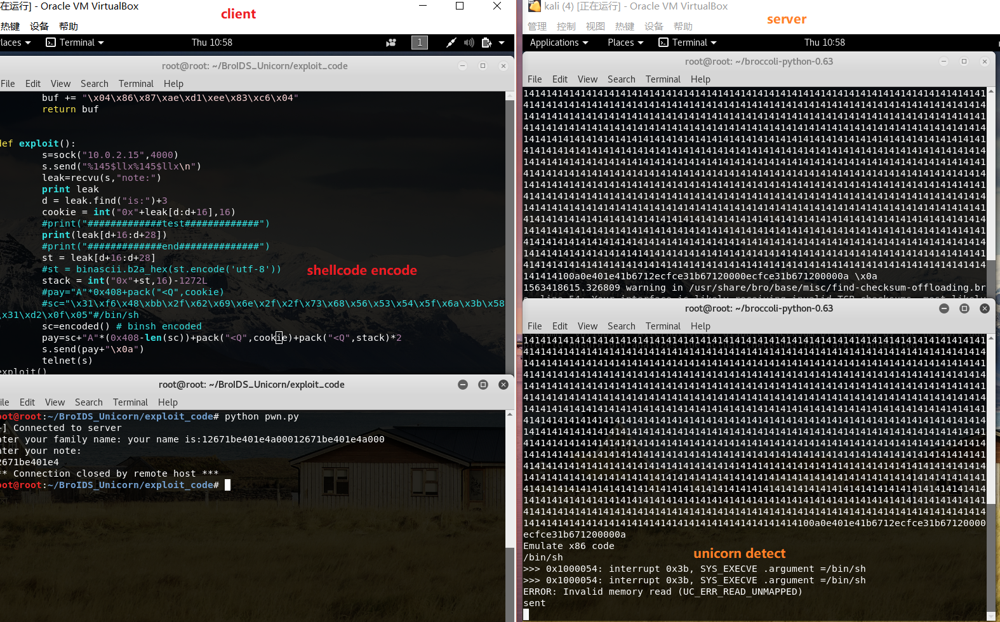
##### 问题
上述实验结果存在错误，因为之前没有深入研究测试代码，所以没有意识到错误，之后会进一步研究改正