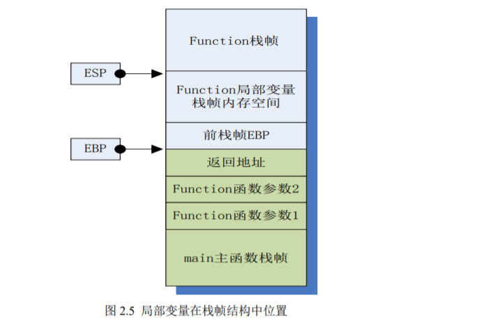
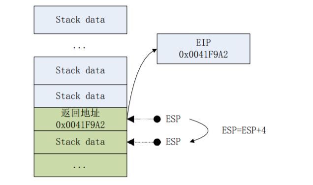
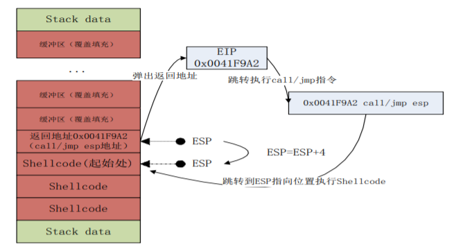

### ShellCode恶意代码检测技术
- 静态检测
- 动态检测
    - 对检测数据进行虚拟执行，解析数据中包含的指令，并对指令进行模拟执行
    - libemu[shellcode动态检测库]，检测数据中是否含有shellcode,并分析指令的执行流程，可获取系统函数调用的列表
#### shellcode组成结构

- 自我定位
    确定自己在内存中确切的起始位置
    
    若局部变量中包含数据类型的缓冲区(如char数组),并且没有对缓冲区进行边界检测，则数组输入数据很可能造成缓冲区越界溢出。从而对栈帧中相近的变量数据进行修改破坏，甚至覆盖栈帧结构中保存前栈帧EBP值，下条指令地址等状态恢复数据。当函数返回时，修改后的返回地址将弹出被加载到指令寄存器EIP中，指令寄存器EIP中存放的数据是即将执行的下一条指令地址，从而使返回地址指向的指令得到执行。
    - 动态定位shellcode
        获取EIP寄存器值。程序运行时，EIP寄存器中保存值为下一条指令的地址。
        修改EIP寄存器为缓冲区中的shellcode起始地址。
        
        
    - 具体特征
    执行调用语句```call```，执行调用时，cpu将返回地址入栈，并跳转到被调用过程的第一条语句，返回地址则是调用语句之后的指令的地址。通过读取返回地址并添加偏移计算有效载荷的地址。
    
        ```bash
        # call指令入栈eip地址。
        A:
        pop  eax
        mov [esp]
        jmp
        ```
- 调用系统函数
    shellcode需要完成对kernel32.dll基地址的定位
    - 利用PEB结构查找
        windows为每个进程分配一个环境块TEB，TEB偏移```0x30```处，fs:[0x30]是PEB指针。通过PEB中包含的PEB_LDR_DATA结构，可得到InInitializationOrderModuleList 模块初始化链表。模块初始化链表中，按顺序存放着 PE 加载内存时初始化模块的信息。因此，可以从中得到 kernel32.dll 的基地址。
    - 利用SEH结构异常处理来查找
    - 堆栈搜索查找
        堆栈搜索实现对DLL的基地址定位也是基于进程环境块TEB。在fs:[0x18]处，可以得到当前运行进程的TEB。TEB偏移[0x4]处，可以得到堆栈头指针并结合SEH结构确定kernel32.dll基地址，得到基地址在[0x3C]处可得PE头。从而获取导出表指针