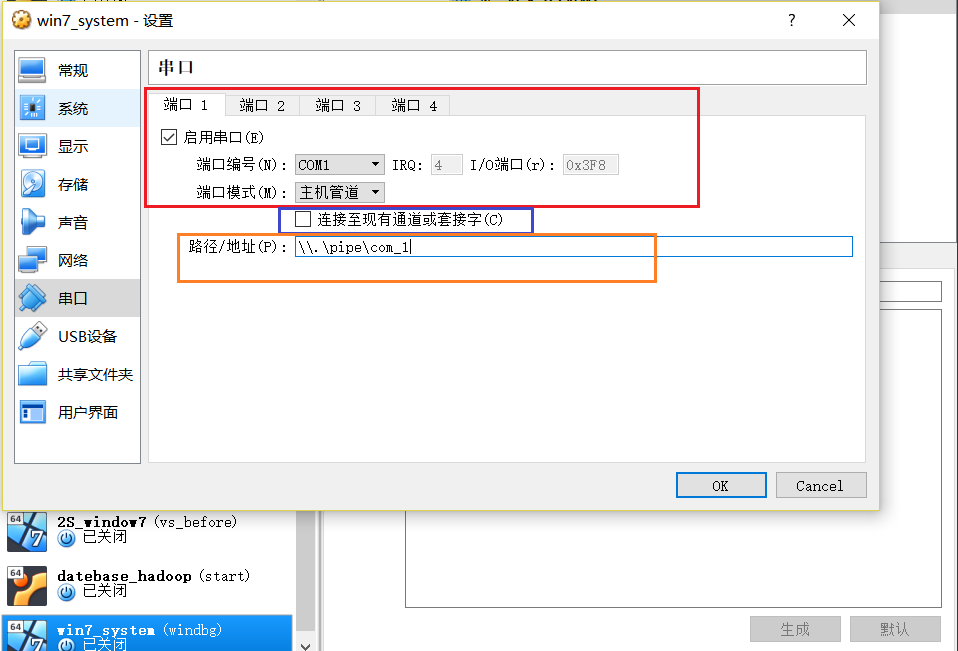
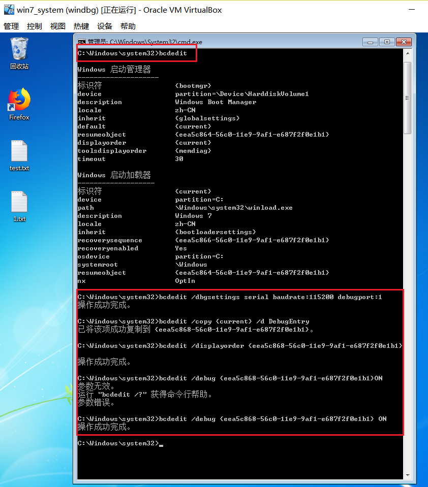
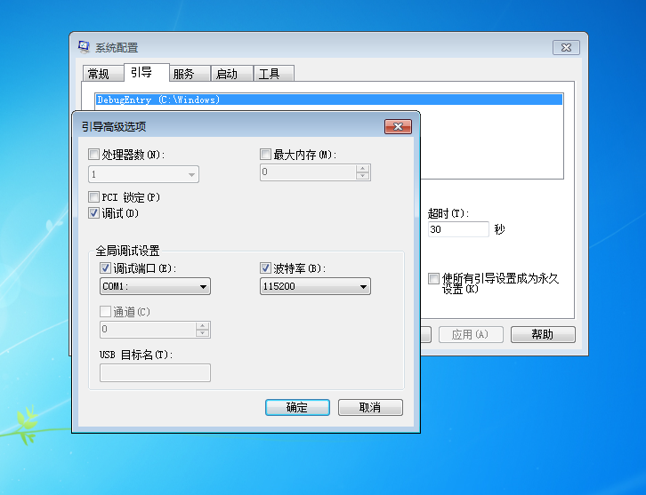

## Windbg_Host[windows10]_Target[Windows7]环境配置

### 实验环境
- Host OS:```Windows10 X64```
- Target:```VirtualBox Windows7 X64```
- Windbg

### 实验步骤
#### Host OS
- 找到```Windbg```,右键选择```属性```,在```目标(T)```栏的冒号后面添加``` -b -k com:pipe,port=\\.\pipe\com_1,resets=0```(注意要在前面添加空格)

#### VirtualBox


#### Target OS
- 以管理员方式打开```cmd.exe```,输入一下命令
    ```
    bcdedit

    # 设置端口1
    bcdedit /dbgsettings serial baudrate:115200 debugport:1

    # 复制开机选项，名为DebugEntry
    bcdedit /copy {current} /d DebugEntry

    # 增加开机引导项(ID为上一条命令生成)
    bcdedit /displayorder {current} {ID}

    # 激活debug
    bcdedit /debug {ID} ON
    ```
    
- 打开```msconfig```配置
    
- 重启目标计算机

### 参考资料
- [win10中“windbg+vmware+win7双机调试”设置](https://blog.csdn.net/Sagittarius_Warrior/article/details/51305046)
- [VMware+Windgb+Win7 内核驱动调试](http://www.cnblogs.com/lzjsky/archive/2010/12/14/1905248.html)
- [Windbg+VirtualBox双机调试环境配置(XP/Win7/Win10)](https://www.cnblogs.com/aliflycoris/p/5877323.html)


