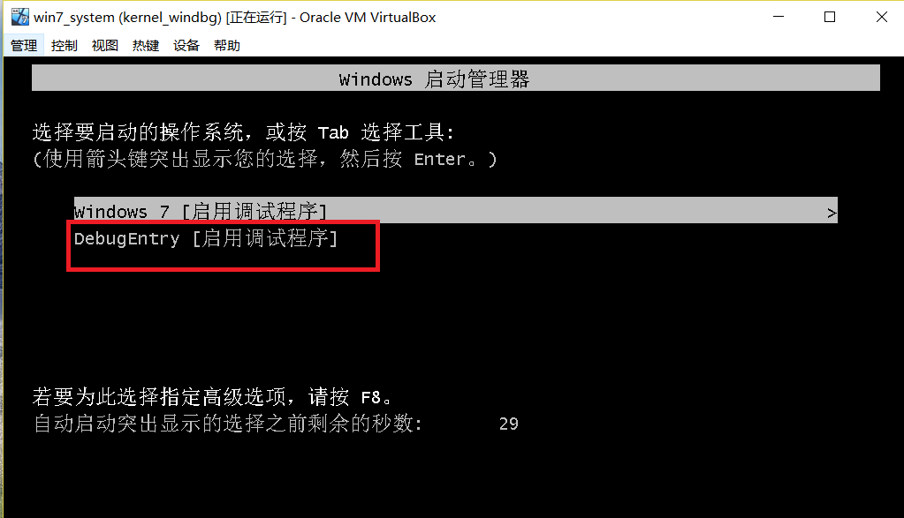
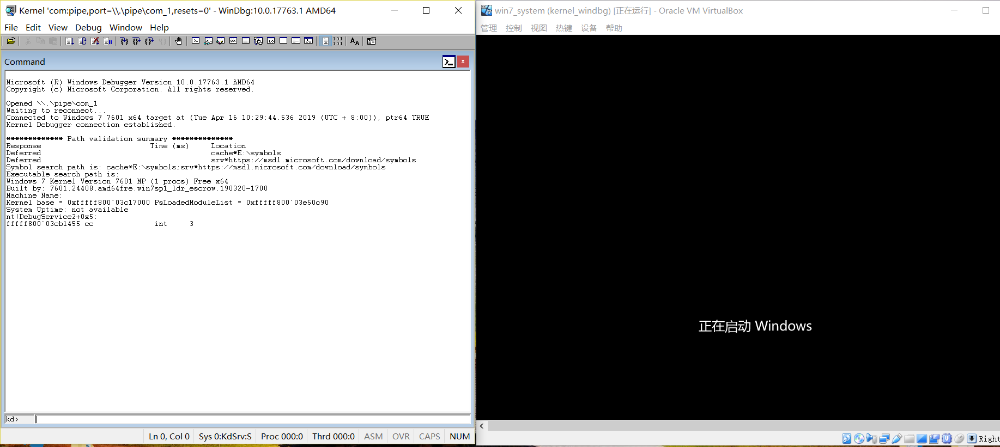
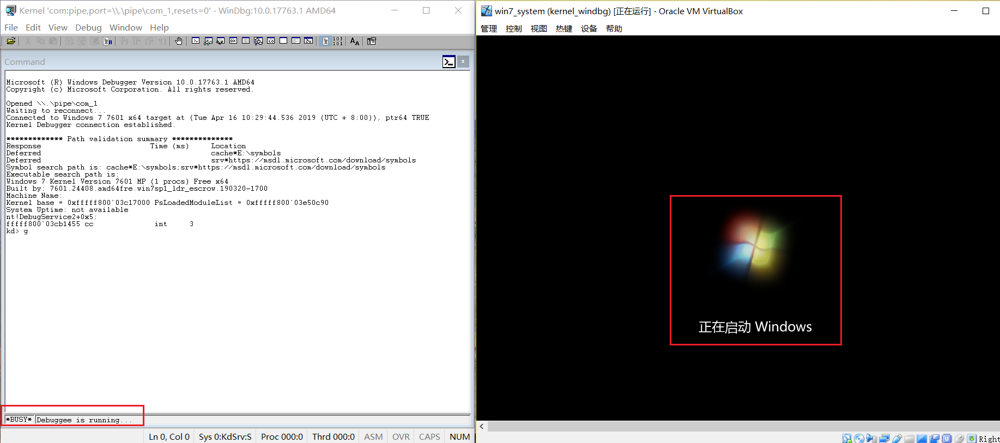
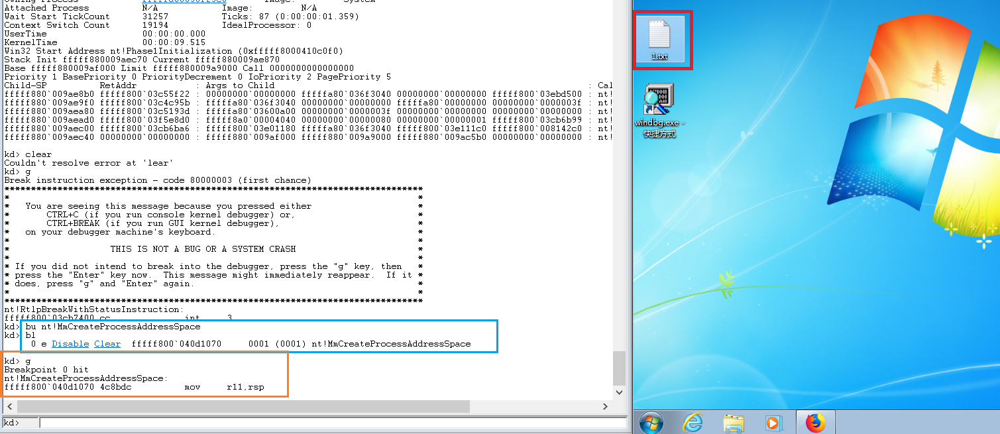
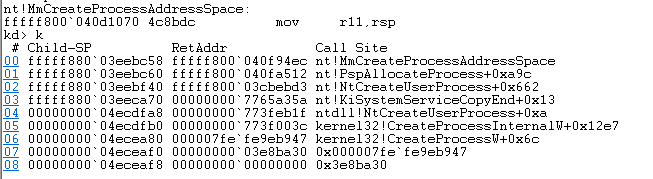
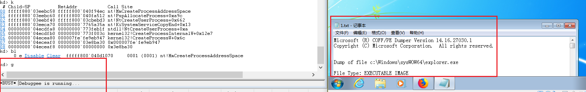

## windbg内核模式下断点
### 实验环境
- Host OS:```Windows10 X64```
- Target:```VirtualBox Windows7 X64```
- Windbg

### 实验步骤
- 主机和目标机器建立连接
    - 打开虚拟机目标机器，选择```DebugEntry```进入
        
    - 选择完入口后立刻在主机上移管理员方式打开```windbg```
        
    - 连接完成后使用```g```命令使目标机器运行，完成开机
        

    - 开机后在```windbg```中点击```Debug-->break```
- 对```MmCreateProcessAddressSpace```下断点
    - 输入如下命令
        ```
        bu nt!MmCreateProcessAddressSpace
        ```
    - 查看断点```bl```:
        
    - 使目标机器运行```g```
    - 如果目标机器没有被中断,则在目标机器中打开```notepad.exe```等,调试器会显示中断
        
    - 查看进程堆栈相关信息
        ```
        .reload
        k
        ```
        
    - 输入```g```使目标机器运行
        
### 参考资料
- [Getting Started with WinDbg (Kernel-Mode)](https://docs.microsoft.com/en-us/windows-hardware/drivers/debugger/getting-started-with-windbg--kernel-mode-)
- [k, kb, kc, kd, kp, kP, kv (Display Stack Backtrace)](https://docs.microsoft.com/en-us/windows-hardware/drivers/debugger/k--kb--kc--kd--kp--kp--kv--display-stack-backtrace-)


